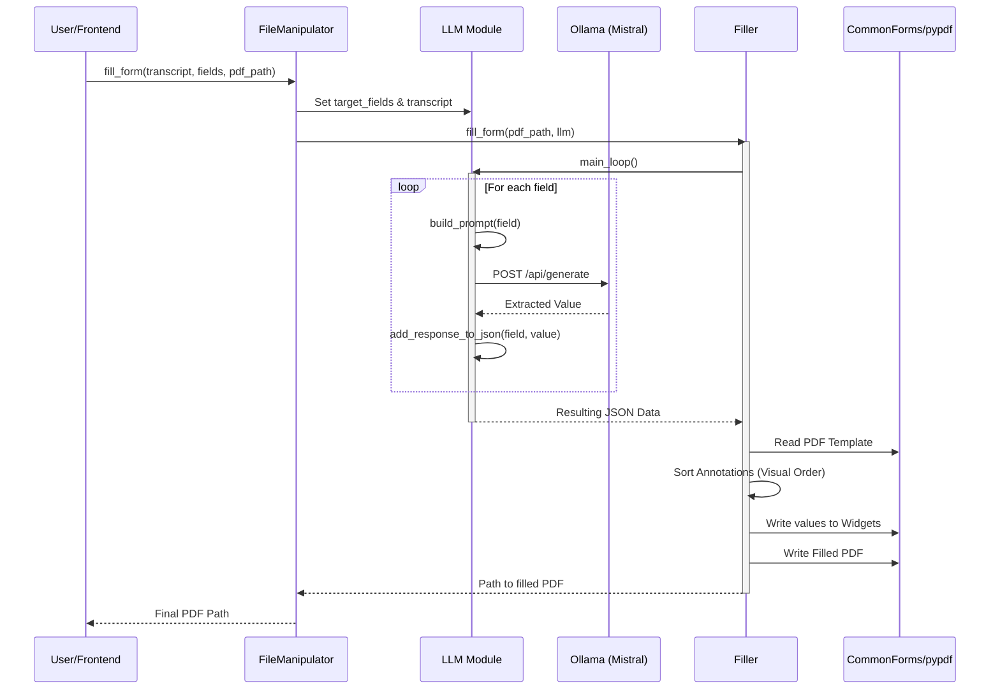

# FireForm Architecture

FireForm is a system designed to automate the process of filling out PDF forms using information extracted from transcriptions (e.g., voice recordings) via an LLM.

## Pipeline Description

The FireForm pipeline follows a structured flow from receiving raw user input to generating a finalized, filled PDF document.

### High-Level Flow

1.  **Template Preparation**: A standard PDF is processed to ensure it has interactive form fields.
2.  **Input Acquisition**: The system receives a transcript (text) and a list of target fields to extract.
3.  **LLM Extraction**: An LLM (via Ollama) processes the transcript to find values for each target field.
4.  **Form Filling**: extracted values are mapped and written into the PDF template.
5.  **Output Generation**: A new, filled PDF is saved with a timestamped filename.

### Component Interaction

### Key Components

-   **`FileManipulator`**: The high-level orchestrator that manages the overall process.
-   **`LLM`**: Handles prompt engineering and communication with the local Ollama instance (typically using the Mistral model). It extracts structured data from unstructured text.
-   **`Filler`**: Handles the low-level PDF manipulation, ensuring that extracted data is placed into the correct form fields based on their visual order.
-   **`commonforms`**: A dependency used to prepare standard PDFs for filling.
-   **`pdfrw` / `pypdf`**: Libraries used for reading and writing PDF metadata and form field values.
